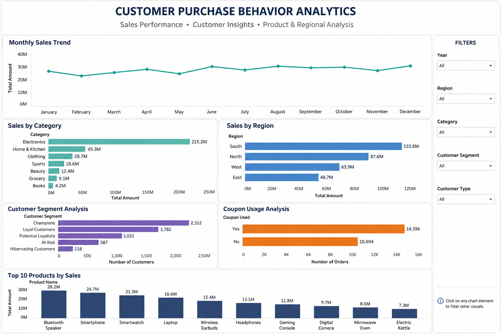

# 📊 Customer Purchase Behavior Analytics Dashboard

An interactive analytics dashboard analyzing customer purchase behavior across sales performance, customer segmentation, and product/regional trends — built to help identify where revenue is concentrated and which customer segments matter most.

## 📌 What this covers

- **Monthly sales trend** — full-year view of total sales, ranging roughly $23M–$31M per month with a steady upward drift toward year-end
- **Sales by category** — Electronics dominates at $215.2M, more than 4x the next closest category (Home & Kitchen at $45.3M)
- **Sales by region** — South leads at $110.8M, followed by North, West, and East
- **Customer segment analysis** — customers broken into Champions (2,312), Loyal Customers (1,782), Potential Loyalists (1,021), At Risk (587), and Hibernating Customers (218)
- **Coupon usage analysis** — 14,396 orders used a coupon vs. 10,604 that didn't, showing coupons drive a majority of purchases
- **Top 10 products by sales** — led by Bluetooth Speaker ($28.2M), Smartphone ($24.7M), and Smartwatch ($21.3M)

## 🛠️ Tools & approach

- **Python (Pandas, Matplotlib, Seaborn)** — data cleaning, feature engineering (net sales, profit margin, discount flags), and business KPI analysis by category, region, customer type, subscription status, and discount usage
- **Customer segmentation** — quartile-based spend segmentation (Low / Medium / High / Premium Value) built on aggregated customer-level data
- **Power BI / Tableau** — interactive dashboard with filters for Year, Region, Category, Customer Segment, and Customer Type, built from the cleaned and exported data

## 📂 In this repo

| File | What it is |
|---|---|
| `customer_purchase_behavior.csv` | Raw dataset — customer purchase records with demographics, product, payment, and review data |
| `customer_purchase_eda.ipynb` | Python notebook — data cleaning, feature engineering, KPI analysis, customer segmentation, and Tableau-ready data export |
| `Dashboard.png` | Dashboard screenshot |

## 🔍 Key insight

Electronics drives the overwhelming majority of revenue, and coupon-driven orders (58%) outnumber non-coupon orders — suggesting promotions are a major lever for this customer base rather than a marginal one.

## 🚀 View it

Open the dashboard file in Power BI Desktop, or view `Dashboard.png` for a quick look at the layout.
